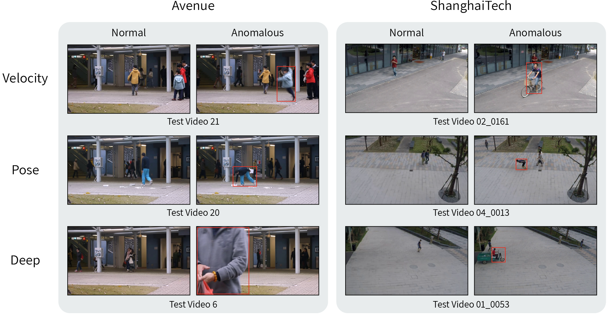

## Interpretable_VAD
Official Implementation of "Attribute-based Representations for Accurate and Interpretable Video Anomaly Detection". [\[arXiv\]]()



## 1. Dependencies
```
python==3.7
torch==1.12.0+cu102
```
This repo uses github Large File Storage. Therefore, after cloning the repository, run the following command to download the pose representations:
```
git lfs pull
```
Alternatively, download ```./data/shanghaitech/train/pose.npy``` manually and place it in the same path (195 MB npy file).
## 2. Usage
### 2.1 Data download and Preparation
To download the evaluation datasets, please follow the [instructions](./data/README.md).

### 2.2 Data preparation
The training and testing datasets should be preprocessed according to the these [instructions](./pre_processing/README.md).

### 2.3 Feature Extraction
For extracting velocity and deep representations, run the following command:

```
python feature_extraction.py [--dataset_name]
```

Pose representations have already been provided by us.

### 2.4 Score calibration
To compute calibration parameters for each representation, run the following command:
```
python score_calibration.py [--dataset_name]
```
### 2.4 Evaluation
Finally, you can evaluate by running the following command:
```
python evaluate.py [--dataset_name] [--sigma]
```
We usually use ```--sigma=3``` for Ped2 and Avenue, and ```--sigma=7``` for ShanghaiTech.

You can download our set of representations for Ped2, Avenue and ShanghaiTech datasets from [here](https://drive.google.com/drive/folders/1vSMpDb5jIyc2tNJaYVphguUlFcwPayms?usp=sharing).

## 3. Results

| UCSD Ped2 | CUHK Avenue | ShanghaiTech |
|:---------:|:-----------:|:------------:|
|   99.1%   |    93.6%    |    85.9%     |


## Citation
If you find this useful, please cite our paper:
```

```
